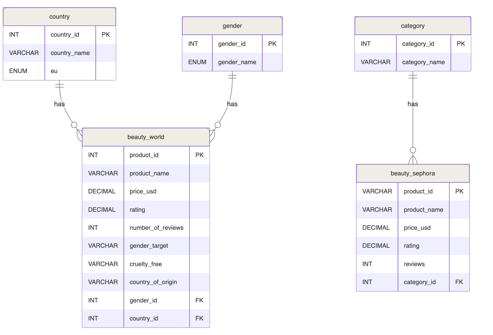

# Beauty Market Analysis
### Is Sephora a good launchpad for a beauty brand with global ambitions?

A data analysis project combining Sephora's product catalog with a global beauty consumer dataset to map market structure, consumer targeting, pricing dynamics, and ethical positioning.

---

## Project context

This project was built as part of a data analysis training program. The analysis is presented from the perspective of two researchers investigating whether Sephora accurately reflects the global beauty market and what that means for a brand looking to launch and expand in the EU market.

### Project presentation
https://docs.google.com/presentation/d/1LAG3IEvvtY3rd52WlLuxbaos3TKq7kmd/edit?usp=sharing&ouid=116785207806004174375&rtpof=true&sd=true

---

## Datasets

| Dataset | Source | Description |
|---|---|---|
| `product_info.csv` | [Sephora Products & Skincare Reviews — Kaggle](https://www.kaggle.com/datasets/nadyinky/sephora-products-and-skincare-reviews) | 8,000+ Sephora products with pricing, ratings, reviews, and product attributes |
| `most_used_beauty_cosmetics_products_extended.csv` | [Most Used Beauty Cosmetics Products — Kaggle](https://www.kaggle.com/datasets/waqi786/most-used-beauty-cosmetics-products-in-the-world) | Global beauty product usage data across countries, age groups, skin types, and gender |

---

## Business hypotheses

| # | Hypothesis | Dataset | Variables |
|---|---|---|---|
| H1 | The higher the price, the lower the rating | Both | price, rating |
| H2 | EU countries have more cruelty-free products than the rest of the world | Worldwide | country, cruelty_free, product count |
| H3 | Skincare accounts for more than 40% of Sephora's catalog | Sephora | category, product count |

## Analysis conclusions

| Hypothesis | Status | Key Data Point | Executive Takeaway |
|---|:---:|---|---|
| Higher price → lower ratings | ❌ Rejected | 4.07–4.36 range across all tiers | No rating risk at any price point |
| EU has more cruelty-free products | ✅ Confirmed | — | Cruelty-free certification is an expectation at this market stage |
| Skincare > 40% of Sephora catalog | ❌ Rejected | Skincare = 19.7% | Skincare is less crowded than expected |

---

## Project structure
 
```
beauty_project/sql_beauty_project/
│
├── data/
│   ├── processed/
│   │   ├── dim_category.csv
│   │   ├── dim_country_id.csv
│   │   └── dim_gender.csv
│   │
│   ├── query-results/
│   │   ├── sephora products average rating per price.csv
│   │   ├── sephora share of each category in the catalog.csv
│   │   ├── sephora skincare vs everything else.csv
│   │   ├── world dataset in EU cruelty free product.csv
│   │   └── World products average rating per price.csv
│   │
│   └── raw/
│       ├── sephora_clean.csv
│       └── world_clean.csv
│
├── notebooks/
│   ├── beauty-sephora-data-processing.ipynb
│   ├── beauty-world-data-processing.ipynb
│   └── data-analysis.ipynb
│
├── sql-scripts/
│   ├── create-schema.sql
│   └── query-scripts.sql
│
├── ER-diagram.png
└── README.md
```

---

## Database schema

The project uses 4 analytical tables built on top of 2 raw tables loaded from Python.



---

## SQL concepts used

| Concept | Used in |
|---|---|
| `GROUP BY` | H1, H2, H3 |
| `JOIN` | H3 |
| Subqueries | H1, H2, H5 |
| `AVG`, `COUNT`, `SUM` | All hypotheses |

---
## How to get the data
 
The datasets are sourced from Kaggle via `kagglehub`. Install it, run the download, and use the local path it returns to load your dataframes.
 
```bash
pip install kagglehub
```
 
```python
import kagglehub
path = kagglehub.dataset_download("nadyinky/sephora-products-and-skincare-reviews")
print("Path to dataset files:", path)  # use this path to read your CSVs
```
 
---

## Authors

- Valeria ACEVEDO
- Hanane MAMALIK
